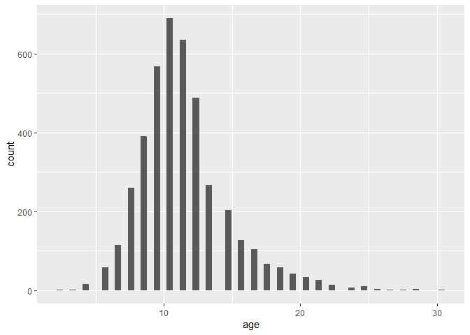

Homework 2: Linear Regression
================
Carly Greutert

``` r
library(caret)
```

    ## Loading required package: ggplot2

    ## Loading required package: lattice

``` r
library(dplyr)
```

    ## 
    ## Attaching package: 'dplyr'

    ## The following objects are masked from 'package:stats':
    ## 
    ##     filter, lag

    ## The following objects are masked from 'package:base':
    ## 
    ##     intersect, setdiff, setequal, union

``` r
library(ggplot2)
library(tidyverse)
```

    ## -- Attaching packages --------------------------------------- tidyverse 1.3.1 --

    ## v tibble  3.1.6     v purrr   0.3.4
    ## v tidyr   1.2.0     v stringr 1.4.0
    ## v readr   2.1.1     v forcats 0.5.1

    ## -- Conflicts ------------------------------------------ tidyverse_conflicts() --
    ## x dplyr::filter() masks stats::filter()
    ## x dplyr::lag()    masks stats::lag()
    ## x purrr::lift()   masks caret::lift()

``` r
library(tidymodels)
```

    ## -- Attaching packages -------------------------------------- tidymodels 0.2.0 --

    ## v broom        0.7.12     v rsample      0.1.1 
    ## v dials        0.1.1      v tune         0.2.0 
    ## v infer        1.0.0      v workflows    0.2.6 
    ## v modeldata    0.1.1      v workflowsets 0.2.1 
    ## v parsnip      0.2.1      v yardstick    0.0.9 
    ## v recipes      0.2.0

    ## -- Conflicts ----------------------------------------- tidymodels_conflicts() --
    ## x scales::discard()        masks purrr::discard()
    ## x dplyr::filter()          masks stats::filter()
    ## x recipes::fixed()         masks stringr::fixed()
    ## x dplyr::lag()             masks stats::lag()
    ## x purrr::lift()            masks caret::lift()
    ## x yardstick::precision()   masks caret::precision()
    ## x yardstick::recall()      masks caret::recall()
    ## x yardstick::sensitivity() masks caret::sensitivity()
    ## x yardstick::spec()        masks readr::spec()
    ## x yardstick::specificity() masks caret::specificity()
    ## x recipes::step()          masks stats::step()
    ## * Learn how to get started at https://www.tidymodels.org/start/

``` r
library(corrplot)
```

    ## corrplot 0.92 loaded

``` r
library(ggthemes)
library(cli)
library(recipes)
library(yardstick)
tidymodels_prefer()
```

1.  

``` r
abalone <- read_csv('C:\\Program Files\\Git\\tmp\\131-hw2\\abalone.csv')
```

    ## Rows: 4177 Columns: 9
    ## -- Column specification --------------------------------------------------------
    ## Delimiter: ","
    ## chr (1): type
    ## dbl (8): longest_shell, diameter, height, whole_weight, shucked_weight, visc...
    ## 
    ## i Use `spec()` to retrieve the full column specification for this data.
    ## i Specify the column types or set `show_col_types = FALSE` to quiet this message.

``` r
abalone <- abalone %>% 
mutate(age = rings + 1.5)
abalone <- subset(abalone, select = -(rings))
abalone %>% 
ggplot(aes(x = age))+ geom_histogram(bins = 60)
```

<!-- -->

Age seems to be normally distributed, although slightly positively
skewed, with 11 being roughly the mean age, although it has a few older
outliers. 2.

``` r
set.seed(1111)
abalone_split <- initial_split(abalone, prop = 0.80, strata = 'age')
abalone_train <- training(abalone_split)
abalone_test <- testing(abalone_split)
```

3.  

``` r
abalone_recipe <- recipe(age ~ ., data = abalone_train)
abalone_recipe <- abalone_recipe %>% 
  step_dummy(all_nominal_predictors())%>%
  step_interact(~contains('type'):shucked_weight) %>%
  step_interact(~longest_shell:diameter)%>%
  step_interact(~shucked_weight:shell_weight)%>% 
  step_center(all_predictors()) %>%
  step_scale(all_predictors())
abalone_recipe
```

    ## Recipe
    ## 
    ## Inputs:
    ## 
    ##       role #variables
    ##    outcome          1
    ##  predictor          8
    ## 
    ## Operations:
    ## 
    ## Dummy variables from all_nominal_predictors()
    ## Interactions with contains("type"):shucked_weight
    ## Interactions with longest_shell:diameter
    ## Interactions with shucked_weight:shell_weight
    ## Centering for all_predictors()
    ## Scaling for all_predictors()

You should not use rings to predict age since age is directly derived
from the recorded rings, so there is no element of randomness.
Furthermore, the goal is to not need to cut open the abalone and count
the rings to predict age.  
4.

``` r
lm_model <- linear_reg() %>% 
  set_engine("lm")
```

5.  

``` r
lm_wflow <- workflow() %>% 
  add_model(lm_model) %>% 
  add_recipe(abalone_recipe)
```

6.  

``` r
lm_fit <- fit(lm_wflow, abalone_train)
fabalone <- data.frame(type = 'F', longest_shell = 0.50, diameter = 0.10, height = 0.30, whole_weight = 4, shucked_weight = 1, viscera_weight = 2, shell_weight = 1)
predict(lm_fit, fabalone)
```

    ## # A tibble: 1 x 1
    ##   .pred
    ##   <dbl>
    ## 1  21.7

7.  

``` r
abalone_metrics <- metric_set(rmse, rsq, mae)
abalone_train_res <- predict(lm_fit, new_data = abalone_train %>% select(-age))
abalone_train_res <- bind_cols(abalone_train_res, abalone_train %>% select(age))
abalone_train_res %>% head()
```

    ## # A tibble: 6 x 2
    ##   .pred   age
    ##   <dbl> <dbl>
    ## 1  9.51   8.5
    ## 2  8.06   8.5
    ## 3  9.28   9.5
    ## 4  9.77   8.5
    ## 5 10.5    8.5
    ## 6 10.0    9.5

``` r
abalone_metrics(abalone_train_res, truth = age, 
                estimate = .pred)
```

    ## # A tibble: 3 x 3
    ##   .metric .estimator .estimate
    ##   <chr>   <chr>          <dbl>
    ## 1 rmse    standard       2.14 
    ## 2 rsq     standard       0.563
    ## 3 mae     standard       1.54
